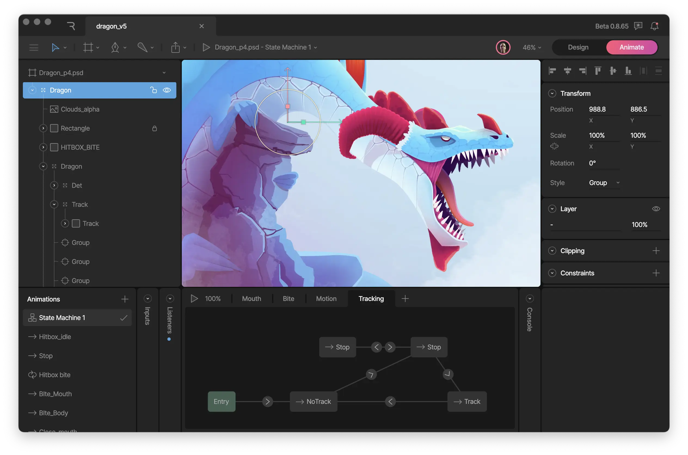
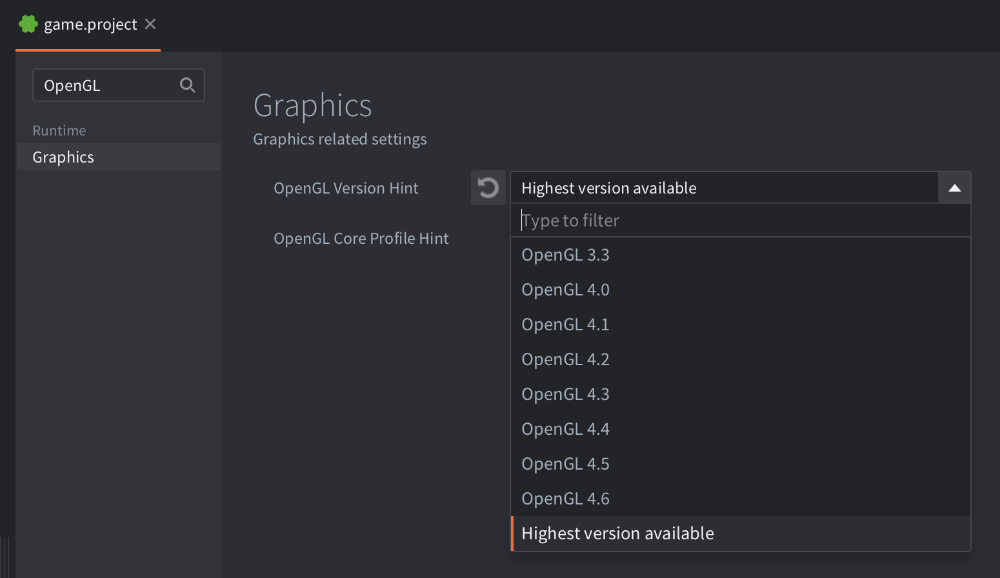
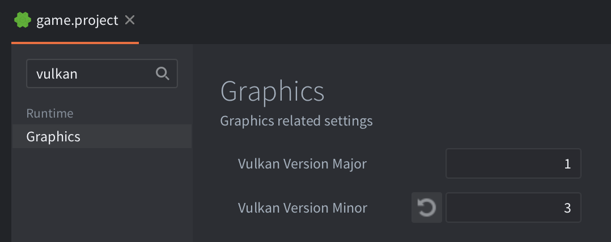
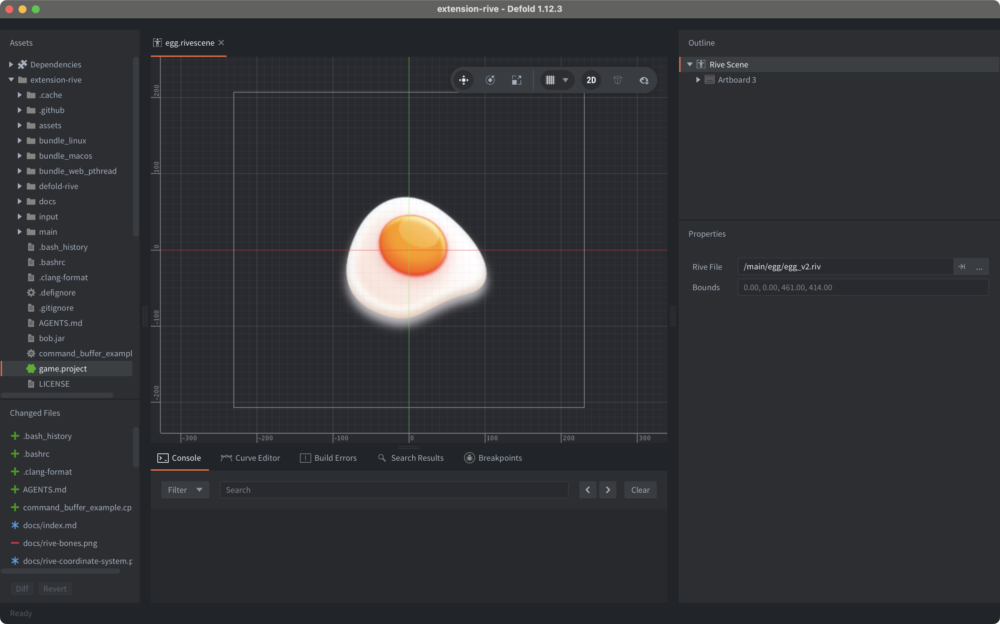
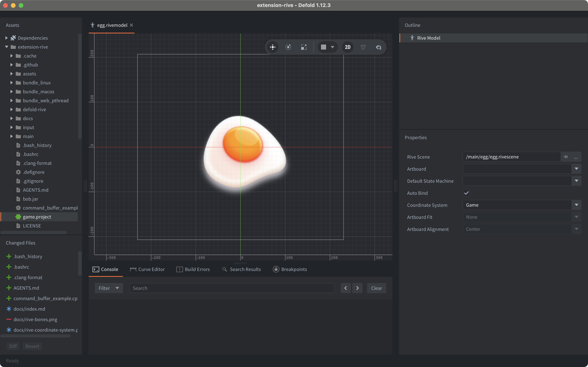
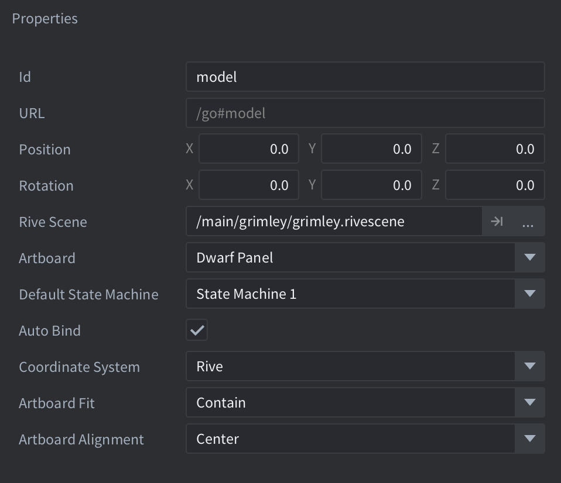
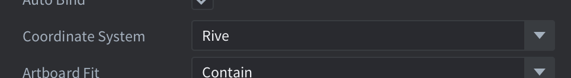

# Rive animation
[Rive](https://rive.app/) is a real-time interactive design and animation tool by Rive Inc.. Use the Rive editor to create vector based motion graphics that respond to different states and user inputs. Rive lets you create advanced timeline animations through animation mixing, interpolation and inverse-kinematics. Transition between animations using [State Machines](https://rive.app/community/doc/state-machine/docwH5zPdh93).




## Requirements
In order to use Rive content usign databindings, you will need to run Defold 1.12.3 or higher.

## Installation
Rive animation support in Defold is provided through an official Rive extension. To use Rive animations in a Defold project, add an URL to the list of `game.project` dependencies:

[https://github.com/defold/extension-rive/archive/main.zip](https://github.com/defold/extension-rive/archive/<release_version>.zip)

We recommend using a link to a zip file of a [specific release](https://github.com/defold/extension-rive/releases).

### Source code
The source code is available on [GitHub](https://github.com/defold/extension-rive)

The functionality is based on the [Unreal plugin](https://github.com/rive-app/rive-unreal)

## OpenGL Support
To use Rive with OpenGL, you need to make sure OpenGL 4.2 or later is used in the engine. To do this, set the `OpenGL version hint` to either 4.2 or `Use highest available`:



## Vulkan Support
To use Rive with Vulkan, you need to make to use Vulkan 1.3. To do this, set the `Graphics - Vulkan Version Major` / `Graphics - Vulkan Version Minor` to either 1.3 or higher.



## Rendering

The Rive extension is using a native renderer from the [Rive runtime]()https://github.com/rive-app/rive-runtime itself by issuing raw graphics API calls behind the scenes.
The low-level renderer doesn't rasterize rive paths using regular triangles - instead a complex series of draw commands are issued that will produce smooth vector graphics.
With this in mind, there are a few caveats for how the renderer works together with the regular Defold rendering.

## Creating a Rive scene
Create a Rive scene by (<kbd>right click</kbd> a location in the *Assets* browser, then select <kbd>New... ▸ Rive Scene</kbd> from the context menu). Select the Rive data file to use from the Rive File field in the *Properties* panel.



Once a Rive file has been selected a preview will be shown in the main *Editor* scene view and in the *Outline* panel.

::: note
In this view you can inspect the full hierarchy of the rive scene.
:::

## Creating Rive model components
Select a game object to hold the new component:

Either create the component in-place (<kbd>right click</kbd> the game object and select <kbd>Add Component ▸ Rive Model</kbd>)

Or create it on file first (<kbd>right click</kbd> a location in the *Assets* browser, then select <kbd>New... ▸ Rive Model</kbd> from the context menu), then add the file to the game object by <kbd>right clicking</kbd> the game object and selecting <kbd>Add Component File</kbd>).

The Rive model can now be viewed in the editor:




### Rive model properties
Apart from the properties *Id*, *Position* and *Rotation* the following component specific properties exist:

* *Rive Scene*
: Set this to the Rive scene file to use for this model.

* *Artboard*
: Set this to the Artboard you want the model to start with. An empty field will use the default artboard.

* *Default State Machine*
: Set this to the State Machine you want the model to start with. An empty field will use the default state machine.

* *Auto Bind*
: Set this to true, if you wish to automatically bind a default View Model Instance upon creation

* *Coordinate System*
: Set this to `Game`, if you wish to move the object around. Set it to `Rive` to keep it fullscreen.

* *Artboard Fit*
: When using `Rive` coordinate system, how is the scene fitting into the screen area.

* *Artboard Alignment*
: When using `Rive` coordinate system, how is the scene aligned within the screen area.



### Coordinate systems

The extension exposes two different coordinate systems that can be used to position the Rive content on screen:



* *Game*
: Similar to the other Defold components, Y coordinates increase upwards.

The Rive model object will inherit its transform from the parent game object.

* *Rive*
: The Rive content will be placed according to the Rive coordinate system, where Y increases downwards from top-left. The placement can be further controlled by changing the `Fit` and `Alignment` modes on the Rive model component.

When using the `Rive` coordinate system, the `Fit` and `Alignment` settings affect how the Rive content is rendered.

The `Fit` parameter determines how the Rive content will be fitted to the view. There are a number of options available:

* *Cover*
: Rive will cover the view, preserving the aspect ratio. If the Rive content has a different ratio to the view, then the Rive content will be clipped.

* *Contain*
: Rive content will be contained within the view, preserving the aspect ratio. If the ratios differ, then a portion of the view will be unused.

* *Fill*
: Rive content will fill the available view. If the aspect ratios differ, then the Rive content will be stretched.

* *FitWidth*
: Rive content will fill to the width of the view. This may result in clipping or unfilled view space.

* *FitHeight*
: Rive content will fill to the height of the view. This may result in clipping or unfilled view space.

* *None*
: (Default) Rive content will render to the size of its artboard, which may result in clipping or unfilled view space.

* *ScaleDown*
: Rive content is scaled down to the size of the view, preserving the aspect ratio. This is equivalent to Contain when the content is larger than the canvas. If the canvas is larger, then ScaleDown will not scale up.

### Alignment

The `Alignment` parameter determines how the content aligns with respect to the view bounds. The following options are available:

* *Center (Default)*
* *TopLeft*
* *TopCenter*
* *TopRight*
* *CenterLeft*
* *CenterRight*
* *BottomLeft*
* *BottomCenter*
* *BottomRight*

### Mixing Defold and Rive content

The Rive API does not have an exposed projection matrix that can be set, which means that in order to match the Rive coordinate space, a fullscreen projection is used in the render script.
To help with mixing Defold and Rive content, the extension provides the helper function `rive.get_projection_matrix()` that can be used as the projection matrix in the render script:

```
render.set_projection_matrix(rive.get_projection_matrix())
render.set_viewport(0, 0, render.get_window_width(), render.get_window_height())
-- The rive component and sprite components will now be in the same coordinate system,
-- as long as the coordinate system for Rive model used in the scene is set to "fullscreen"!
render.draw(self.rive_pred)
render.draw(self.sprite_pred)
```

::: important
If you want to mix Defold and Rive content, you will need to set the `Coordinate system` field on the Rive component to "Fullscreen" in order to be able to place components in the same space.
:::

For convenience, there is a modified render script included with the projection matrix extension. Open your *game.project* file and modify the `Render` field in the `Bootstrap` section to use the `defold-rive/lua/rive.render` file from this extension.

### View matrix

View matrices are supported, but only in 2D space since Rive content is essentially orthographic by design.
For example, using the view matrix from a camera component can be used to implement camera effects, such as screen shakes or as a regular game camera in 2D.

Note! Support for using a view matrix / camera component to display Rive content is currently considered a work-in-progress and might not work as expected yet.

::: important
If you want to use a view matrix in 3D space, you will need to set the `Coordinate system` field on the Rive component to "Rive" in order to be able to place components in the same space.
:::

### Blending

Blending is currently only supported from within the `.riv` files themselves. Changing the blend mode on the component or the render script will have no effect.

## File types

*Rive data file*
: This file contains a Rive artboard with all of the composition and animation data of a Rive scene. You can export a Rive (.riv) file from the Rive editor.

*Rive scene*
: This file is used to create a reference to a Rive data file (.riv).

*Rive model*
: This file represents a *Rive Model* component that can be added to a game object. It references a *Rive Scene*, blend mode, material and the default State Machine and animation to use.


## Lua scripting

*Rive Model* components can be manipulated at runtime through the `rive` Lua module. The high-level helpers operate on a component URL and are useful for switching the active artboard, state machine, or default view model instance:

```lua
function init(self)
	rive.set_artboard("#rivemodel", "Main")
	rive.set_state_machine("#rivemodel", "State Machine 1")
	rive.set_view_model_instance("#rivemodel", "HudViewModel")
end
```

For lower-level control, the `rive.cmd` namespace exposes handle-based functions for working directly with files, artboards, state machines, and view model instances. Refer to the [API docs for usage](/extension-rive/rive_api/).

### View Model Instances

If the *Auto Bind* property is enabled on the component and the selected artboard has a default view model, a view model instance will be created automatically. You can access the active instance handle with `rive.get_view_model_instance()` and then read or write properties through `rive.cmd.*`:

```lua
function init(self)
	rive.set_view_model_instance("#rivemodel", "HudViewModel")
	self.view_model = rive.get_view_model_instance("#rivemodel")

	rive.cmd.setViewModelInstanceString(self.view_model, "player_name", "Ada")
	rive.cmd.setViewModelInstanceNumber(self.view_model, "score", 42)
	rive.cmd.setViewModelInstanceBool(self.view_model, "show_badge", true)
end
```

For advanced cases, you can create and bind instances manually:

```lua
local file = rive.get_file("#rivemodel")
local artboard = rive.get_artboard("#rivemodel")
local state_machine = rive.get_state_machine("#rivemodel")

local view_model = rive.cmd.instantiateViewModelInstanceNamed(file, artboard, "player_a")
rive.cmd.bindViewModelInstance(state_machine, view_model)
```

This is useful if you need a specific named instance instead of the default instance for a view model.

#### Input

[Listeners](https://rive.app/community/doc/listeners/doceaiA9rRW1) can be used to define click, hover, and mouse move actions that can change State Machine Inputs at runtime. You can forward mouse and touch actions to a State Machine in a *Rive Model* component like this:

```lua
function on_input(self, action_id, action)
	if not action_id or action_id == hash("touch") then
		if action.pressed then
			rive.pointer_down("#rivemodel", action.x, action.y)
		elseif action.released then
			rive.pointer_up("#rivemodel", action.x, action.y)
		else
			rive.pointer_move("#rivemodel", action.x, action.y)
		end
	end
end
```


### Getting and setting Text

Text Run access is not currently exposed through the public Lua API in this extension branch. If you need dynamic text today, the recommended approach is to expose the text through a View Model property in Rive and update it through `rive.cmd.setViewModelInstanceString()`.

## Deprecations from earlier versions

The current integration follows Rive's data binding workflow. As part of that cleanup, several older component settings are no longer supported:

* The legacy `Fullscreen` coordinate system has been removed. Use `Game` for game-object transforms or `Rive` for artboard fit/alignment driven placement.
* Custom `Material` overrides on the Rive model component are no longer used.
* The component `Blend mode` override is no longer used. Blending should be authored in the `.riv` content itself.
* `Create GO Bones` is no longer supported.
* Rive scenes should have at least one State Machine
* Previous rive 'Animations' are no longer supported.
