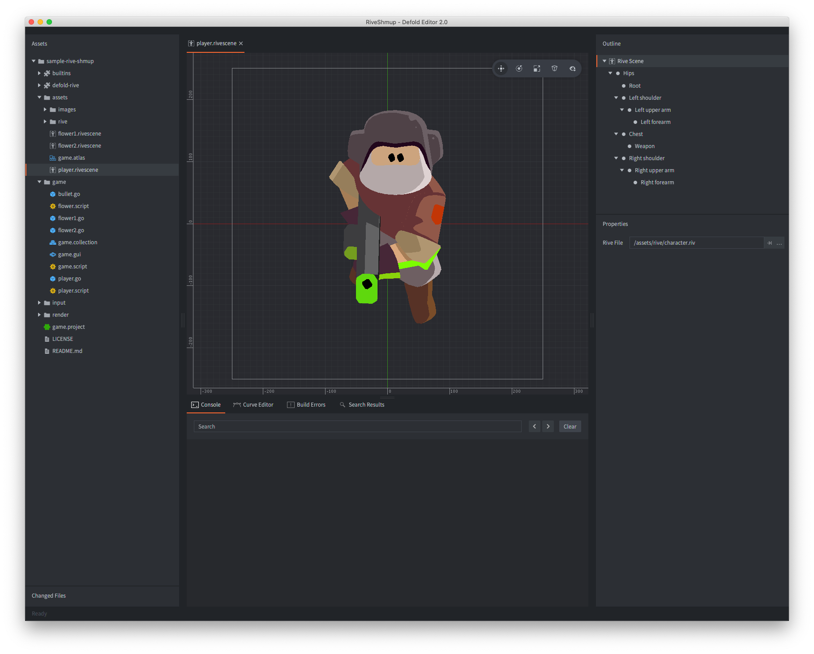
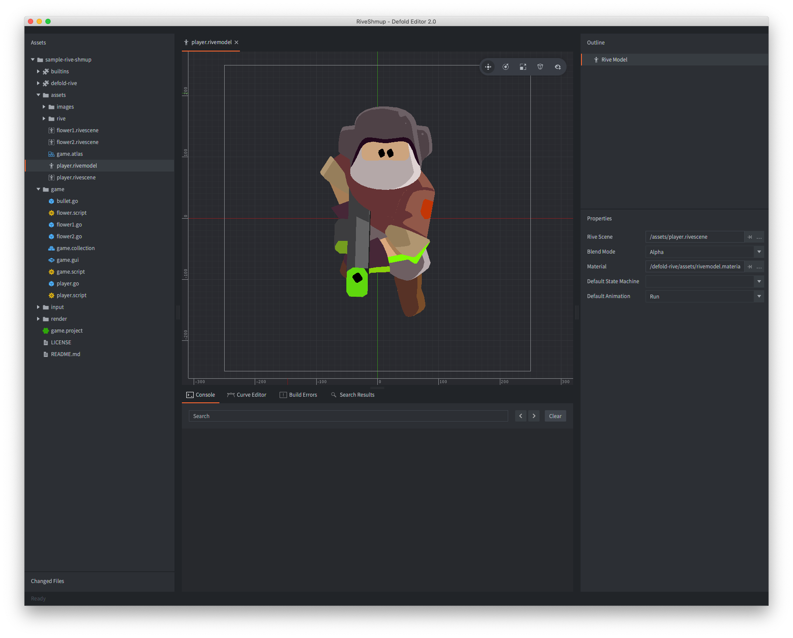
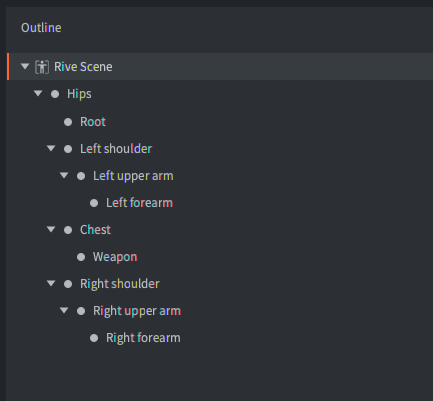

# Rive animation
[Rive](https://rive.app/) is a real-time interactive design and animation tool by Rive Inc.. Use the Rive editor to create vector based motion graphics that respond to different states and user inputs. Rive lets you create advanced timeline animations through animation mixing, interpolation and inverse-kinematics. Transition between animations using state machines.


## Installation
Rive animation support in Defold is provided through an official Rive extension. To use Rive animations in your Defold project, add the following URL to your `game.project` dependencies:

https://github.com/defold/extension-rive/archive/master.zip

We recommend using a link to a zip file of a [specific release](https://github.com/defold/extension-rive/releases).


## Concepts

*Rive data file*
: This file contains a Rive artboard with all of the composition and animation data of a Rive scene. You can export a Rive (.riv) file from the Rive editor.

*Rive scene*
: This file is used to create a reference to a Rive data file (.riv).



*Rive model*
: This file represents a *Rive Model* component that can be added to a game object. It references a *Rive Scene*, blend mode, material and the default state machine and animation to use.




## Importing a Rive artboard


## Creating Rive components


## Playing animations
To play animations on your Rive model, simply call the [`rive.play_anim()`](/ref/rive#rive.play_anim) function:

```lua
function init(self)
	-- Play the "run" animation on the component "rivemodel"
	local options = {
		offset = 0.2, -- start 20% into the animation
		playback_rate = 1.5, -- play the animation at 150% speed
	}
	rive.play_anim("#rivemodel", "run", go.PLAYBACK_ONCE_FORWARD, options, function(self, message_id, message, sender)
		run()
	end)

end
```


## Cursor animation
In addition to using the `rive.play_anim()` to advance a Rive animation, *Rive Model* components expose a "cursor" property that can be manipulated with `go.animate()` (more about [property animations](/manuals/property-animation)):

```lua
-- Set the animation on the spine model but don't run it.
rive.play_anim("#rivemodel", "run", go.PLAYBACK_NONE)

-- Set the cursor to position 0
go.set("#rivemodel", "cursor", 0)

-- Tween the cursor slowly between 0 and 1 pingpong with in-out quad easing.
go.animate("#rivemodel", "cursor", go.PLAYBACK_LOOP_PINGPONG, 1, go.EASING_INOUTQUAD, 6)
```


## Bone hierarchy
The individual bones in the Rive skeleton are represented internally as game objects. In the *Outline* view of the Rive scene, the full hierarchy is visible. You can see each bone's name and its place in the skeleton hierarchy.



With the bone name at hand, you are able to retrieve the instance id of the bone in runtime. The function [`rive.get_go()`](/ref/rive#rive.get_go) returns the id of the specified bone and you can, for instance, child other game objects under the animated game object:

```lua
-- Attach pistol game object to the left forearm
local forearm = rive.get_go("#rivemodel", "Left forearm")
msg.post("pistol", "set_parent", { parent_id = forearm })
```


## Interacting with state machines


## Source code

The source code is available on [GitHub](https://github.com/defold/extension-rive)


## API reference
