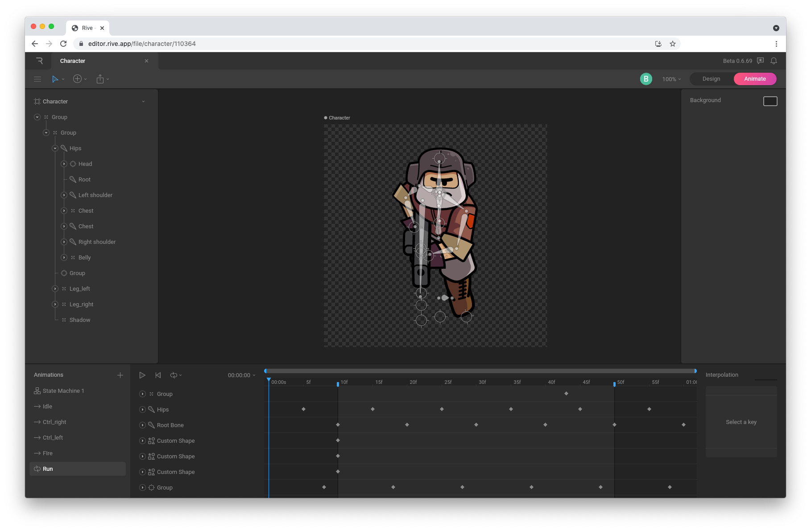
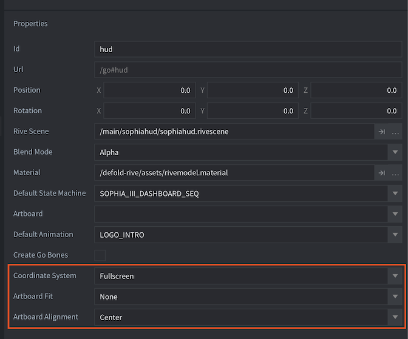
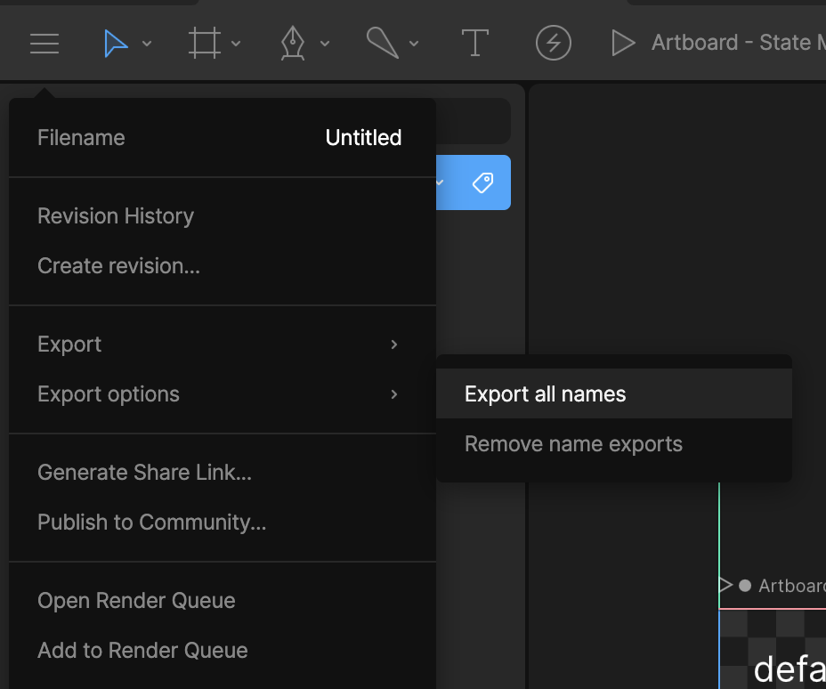

# Rive animation
[Rive](https://rive.app/) is a real-time interactive design and animation tool by Rive Inc.. Use the Rive editor to create vector based motion graphics that respond to different states and user inputs. Rive lets you create advanced timeline animations through animation mixing, interpolation and inverse-kinematics. Transition between animations using [State Machines](https://rive.app/community/doc/state-machine/docwH5zPdh93).




## Requirements
In order to use Rive content, you will need to run Defold 1.9.5 or higher.

## Installation
Rive animation support in Defold is provided through an official Rive extension. To use Rive animations in a Defold project, add the following URL to the list of `game.project` dependencies:

[https://github.com/defold/extension-rive/archive/main.zip](https://github.com/defold/extension-rive/archive/main.zip)

We recommend using a link to a zip file of a [specific release](https://github.com/defold/extension-rive/releases).

## Windows
To use Rive on Windows, you need to make sure OpenGL 4.2 or later is used in the engine. To do this, set the `OpenGL version hint` to either 4.2 or `Use highest available`:


## Rendering

The Rive extension is using a native renderer from the [Rive runtime]()https://github.com/rive-app/rive-runtime itself by issuing raw graphics API calls behind the scenes.
The low-level renderer doesn't rasterize rive paths using regular triangles - instead a complex series of draw commands are issued that will produce smooth vector graphics.
With this in mind, there are a few caveats for how the renderer works together with the regular Defold rendering.

### Coordinate systems

The extension exposes two different coordinate systems that can be used to position the Rive content on screen:

*Fullscreen*
: Similar to the other Defold components, Y coordinates increase upwards.

*Rive*
: The Rive content will be placed according to the Rive coordinate system, where Y increases downwards from top-left. The placement can be further controlled by changing the `Fit` and `Alignment` modes on the Rive model component.



When using the `Rive` coordinate system, the `Fit` and `Alignment` settings affect how the Rive content is rendered.

The `Fit` parameter determines how the Rive content will be fitted to the view. There are a number of options available:

*Cover*
: Rive will cover the view, preserving the aspect ratio. If the Rive content has a different ratio to the view, then the Rive content will be clipped.

*Contain*
: (Default) Rive content will be contained within the view, preserving the aspect ratio. If the ratios differ, then a portion of the view will be unused.

*Fill*
: Rive content will fill the available view. If the aspect ratios differ, then the Rive content will be stretched.

*FitWidth*
: Rive content will fill to the width of the view. This may result in clipping or unfilled view space.

*FitHeight*
: Rive content will fill to the height of the view. This may result in clipping or unfilled view space.

*None (default)*
: Rive content will render to the size of its artboard, which may result in clipping or unfilled view space.

*ScaleDown*
: Rive content is scaled down to the size of the view, preserving the aspect ratio. This is equivalent to Contain when the content is larger than the canvas. If the canvas is larger, then ScaleDown will not scale up.


The `Alignment` parameter determines how the content aligns with respect to the view bounds. The following options are available:

*Center (Default)*
*TopLeft*
*TopCenter*
*TopRight*
*CenterLeft*
*CenterRight*
*BottomLeft*
*BottomCenter*
*BottomRight*

### Mixing Defold and Rive content

The Rive API does not have an exposed projection matrix that can be set, which means that in order to match the Rive coordinate space, a fullscreen projection is used in the render script.
To help with mixing Defold and Rive cxontent, the extension provides the helper function `rive.get_projection_matrix()` that can be used as the projection matrix in the render script:

```
render.set_projection_matrix(rive.get_projection_matrix())
render.set_viewport(0, 0, render.get_window_width(), render.get_window_height())
-- The rive component and sprite components will now be in the same coordinate system,
-- as long as the coordinate system for Rive model used in the scene is set to "fullscreen"!
render.draw(self.rive_pred)
render.draw(self.sprite_pred)
```

::: important
If you want to mix Defold and Rive content, you will need to set the `Coordinate system` field on the Rive component to "Fullscreen" in order to be able to place components in the same space.
:::

For convenience, there is a modified render script included with the projection matrix extension. Open your *game.project* file and modify the `Render` field in the `Bootstrap` section to use the `defold-rive/lua/rive.render` file from this extension.

### View matrix

View matrices are supported, but only in 2D space since Rive content is essentially orthographic by design.
For example, using the view matrix from a camera component can be used to implement camera effects, such as screen shakes or as a regular game camera in 2D.

Note! Support for using a view matrix / camera component to display Rive content is currently considered a work-in-progress and might not work as expected yet.

::: important
If you want to use a view matrix in 3D space, you will need to set the `Coordinate system` field on the Rive component to "Rive" in order to be able to place components in the same space.
:::

### Blending

Blending is currently only supported from within the .riv files themselves. Changing the blend mode on the component or the render script will have no effect.

## Concepts
*Rive data file*
: This file contains a Rive artboard with all of the composition and animation data of a Rive scene. You can export a Rive (.riv) file from the Rive editor.

*Rive scene*
: This file is used to create a reference to a Rive data file (.riv).

*Rive model*
: This file represents a *Rive Model* component that can be added to a game object. It references a *Rive Scene*, blend mode, material and the default State Machine and animation to use.


## Creating a Rive scene
Create a Rive scene by (<kbd>right click</kbd> a location in the *Assets* browser, then select <kbd>New... ▸ Rive Scene</kbd> from the context menu). Select the Rive data file to use from the Rive File field in the *Properties* panel.


Once a Rive file has been selected a preview will be shown in the main *Editor* scene view and the bone hierarchy (see below) will be shown in the *Outline* panel.

::: important
If your Rive scene contains multiple [Artboards](https://help.rive.app/editor/fundamentals/artboards) the Rive integration in Defold will automatically select the Main Artboard from your Rive scene.
:::

## Creating Rive model components
Select a game object to hold the new component:

Either create the component in-place (<kbd>right click</kbd> the game object and select <kbd>Add Component ▸ Rive Model</kbd>)

Or create it on file first (<kbd>right click</kbd> a location in the *Assets* browser, then select <kbd>New... ▸ Rive Model</kbd> from the context menu), then add the file to the game object by <kbd>right clicking</kbd> the game object and selecting <kbd>Add Component File</kbd>).

The Rive model can now be viewed in the editor:


## Rive model properties
Apart from the properties *Id*, *Position* and *Rotation* the following component specific properties exist:

*Rive Scene*
: Set this to the Rive scene file to use for this model.

*Material*
: If you need to render the model with a custom material, change this property.

*Default State Machine*
: Set this to the State Machine you want the model to start with.

*Default Animation*
: Set this to the animation you want the model to start with.


## Runtime manipulation
*Rive Model* components can be manipulated at runtime through a number of different functions and properties (refer to the [API docs for usage](/extension-rive/rive_api/)).


### Playing animations
To play animations on a *Rive Model* component, simply call the [`rive.play_anim()`](/extension-rive/rive_api/#rive.play_anim) function:

```lua
function init(self)
	-- Play the "run" animation on the component "rivemodel"
	local options = {
		offset = 0.2, -- start 20% into the animation
		playback_rate = 1.5, -- play the animation at 150% speed
	}
	rive.play_anim("#rivemodel", "run", go.PLAYBACK_ONCE_FORWARD, options, function(self, message_id, message, sender)
		run()
	end)

end
```


### Cursor animation
In addition to using the `rive.play_anim()` to advance a Rive animation, *Rive Model* components expose a "cursor" property that can be manipulated with `go.animate()` (more about [property animations](/manuals/property-animation)):

```lua
-- Set the animation on the spine model but don't run it.
rive.play_anim("#rivemodel", "run", go.PLAYBACK_NONE)

-- Set the cursor to position 0
go.set("#rivemodel", "cursor", 0)

-- Tween the cursor slowly between 0 and 1 pingpong with in-out quad easing.
go.animate("#rivemodel", "cursor", go.PLAYBACK_LOOP_PINGPONG, 1, go.EASING_INOUTQUAD, 6)
```


### Changing properties

A *Rive Model* component also has a number of different properties that can be manipulated using `go.get()` and `go.set()`:

`animation`
: The current model animation (`hash`) (READ ONLY). You change animation using `rive.play_anim()`.

`cursor`
: The normalized animation cursor (`number`).

`material`
: The rive model material (`hash`). You can change this using a material resource property and `go.set()`. Refer to the [API reference for an example](/extension-rive/rive_api/#material).

`playback_rate`
: The animation playback rate (`number`).


### Interacting with State Machine Inputs
[Inputs](https://rive.app/community/doc/inputs/docwgNrq7ssz) are used to control the transitions in a State Machine by assigning them as conditions in the Rive editor. At runtime it is possible to tie into these inputs from your game logic. In order to modify the inputs the State Machine needs to be started using [`rive.play_state_machine()`](/extension-rive/rive_api/#rive.play_state_machine). Once it has been started it can be interacted with using [`go.set()`](/ref/go#go.set):

```lua
-- Start the State Machine named "State Machine 1"
rive.play_state_machine("#rivemodel", "State Machine 1")

-- Set the boolean value "Trigger 1" to true
go.set("#rivemodel", "Trigger 1", true)

-- Set the numeric value "Number 1" to 0.8
go.set("#rivemodel", "Number 1", 0.8)

-- Read the input value of the current State Machine
local v = rive.get_state_machine_input("#rivemodel", "Number 1")

-- Read the input value of a nested artboard from the current State Machine
local v = rive.get_state_machine_input("#rivemodel", "Number 1", "My_Nested_Artboard")

-- To go deeper into the nested hierarchy, you can add slashes between each scope
local v = rive.get_state_machine_input("#rivemodel", "Number 1", "My_Nested_Artboard/My_Inner_Nested_Artboard")

-- Set the input value of the current State Machine
rive.set_state_machine_input("#rivemodel", "Number 1", 0.5)

-- Set the input value of a nested artboard
rive.set_state_machine_input("#rivemodel", "Number 1", 0.5, "My_Nested_Artboard")

-- Same as the example above, to go even deeper, separate the scopers with slashes!
rive.set_state_machine_input("#rivemodel", "Number 1", 0.5, "My_Nested_Artboard/My_Inner_Nested_Artboard")
```


#### Listeners

[Listeners](https://rive.app/community/doc/listeners/doceaiA9rRW1) can be used to define click, hover, and mouse move actions that can change State Machine Inputs at runtime. You can forward mouse and touch actions to a State Machine in a *Rive Model* component like this:

```lua
function on_input(self, action_id, action)
	if not action_id or action_id == hash("touch") then
		if action.pressed then
			rive.pointer_down("#rivemodel", action.x, action.y)
		elseif action.released then
			rive.pointer_up("#rivemodel", action.x, action.y)
		else
			rive.pointer_move("#rivemodel", action.x, action.y)
		end
	end
end
```


#### Events
Events that trigger while a State Machine is playing are sent to the callback function provided when calling `rive.play_state_machine(url, state_machine_id, options, callback`):

```lua
local function rive_event_handler(self, message_id, message)
	print("received event", message.name)
	pprint(message)
end

function init(self)
	rive.play_state_machine("#rivemodel", "State Machine 1", nil, rive_event_handler)
end
```

If no callback is provided the events will be sent to the calling script as `rive_event_trigger` messages:


```lua
function init(self)
	rive.play_state_machine("#rivemodel", "State Machine 1")
end

function on_message(self, message_id, message, sender)
	if message_id == hash("rive_event_triggered") then
		print("received event", message.name)
		pprint(message)
	end
end
```


### Bone hierarchy
The individual bones in the *Rive Scene* skeleton are represented internally as game objects. In the *Outline* view of the *Rive Scene* the full hierarchy is visible.


With the bone name at hand, it is possible to retrieve the instance id of the bone in runtime. The function [`rive.get_go()`](/extension-rive/rive_api/#rive.get_go) returns the id of the specified bone and it is, for instance, possible to child other game objects under the animated game object:

```lua
-- Attach pistol game object to the left forearm
local forearm = rive.get_go("#rivemodel", "Left forearm")
msg.post("pistol", "set_parent", { parent_id = forearm })
```


### Getting and setting Text Runs
To set and get [Text Runs](https://rive.app/community/doc/text-runs/docrTbOtaAk3), you can use the following functions:

```lua
local text = rive.get_text_run("#rivemodel", "my_text_run")

-- change the text to something else
rive.set_text_run("#rivemodel", "my_text_run", "Hello, World!")

-- you can also access text runs in nested artboards by passing in the artboard name:
rive.get_text_run("#rivemodel", "my_text_run", "my_nested_artboard")

-- accessing nested artboards within nested artboards is also possible
rive.get_text_run("#rivemodel", "my_text_run", "my_nested_artboard/my_other_nested_artboard")

-- the same works with set_text_run:
rive.set_text_run("#rivemodel", "my_text_run", "Hello, World!", "my_nested_artboard")
```

Note! You need to export all the names from within Rive to use these functions:




## Source code
The source code is available on [GitHub](https://github.com/defold/extension-rive)


## API reference
